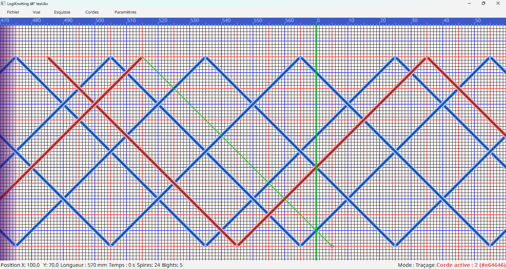
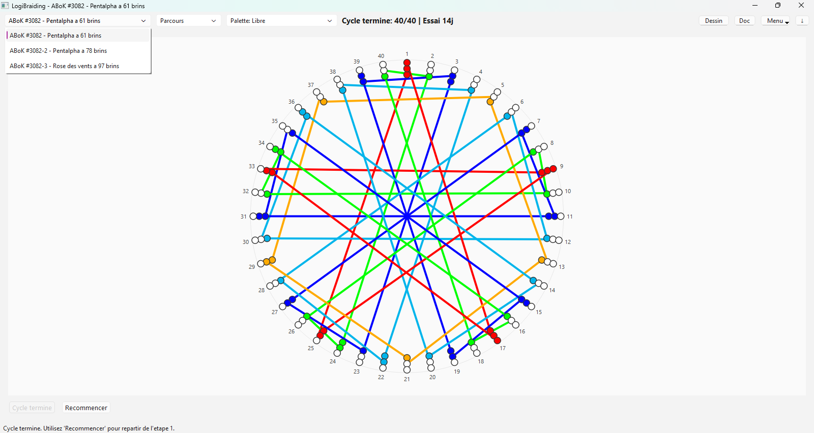

# KnotBraid

KnotBraid est une suite logicielle pour la conception et l’étude de tresses et de nœuds topologiques.
Le dépôt est organisé en **monorepo** afin de publier l’ensemble de la suite dans un seul projet.

## Contenu du dépôt

- `LogiKnotting/` : éditeur topologique de nœuds et de rubans.
- `LogiBraiding/` : outil de travail sur les tresses (ABoK et variantes).
## Captures d'ecran

### LogiKnotting
  

### LogiBraiding
  

## Prérequis

- Windows ou Linux (Ubuntu)
- CMake 3.16 ou supérieur
- Qt 6
- Compilateur C++17 (MSVC, GCC ou Clang)

## Version Qt de reference

Le projet est actuellement compile et teste avec :

- `Qt 6.10.2`
- kit `msvc2022_64`

Si vous recompilez pour un autre environnement, adaptez simplement `CMAKE_PREFIX_PATH`
ou la variable d'environnement `KNOTBRAID_QT_PREFIX` vers votre installation Qt 6.

Note: `launch-suite.ps1`, `launch-suite.sh` et `KnotBraidLauncher` utilisent d'abord `KNOTBRAID_QT_PREFIX`. Sous Linux, ce prefixe peut rester vide si Qt 6 est installe via le systeme.

## Compilation rapide

Depuis la racine du depot :

### LogiKnotting

```powershell
cmake -S LogiKnotting -B LogiKnotting/build -DCMAKE_PREFIX_PATH="C:/Qt/6.10.2/msvc2022_64"
cmake --build LogiKnotting/build --config Release
```

### LogiBraiding

```powershell
cmake -S LogiBraiding -B LogiBraiding/build -DCMAKE_PREFIX_PATH="C:/Qt/6.10.2/msvc2022_64"
cmake --build LogiBraiding/build --config Release
```

### Ubuntu / Linux

```bash
cmake -S LogiKnotting -B LogiKnotting/build -DCMAKE_BUILD_TYPE=Release
cmake --build LogiKnotting/build

cmake -S LogiBraiding -B LogiBraiding/build -DCMAKE_BUILD_TYPE=Release
cmake --build LogiBraiding/build
```

Pour lancer ou compiler depuis Linux, le depot fournit aussi :

```bash
bash ./launch-suite.sh --build-if-missing
```

## Recuperer depuis GitHub et recompiler sous Ubuntu

Procedure courte :

1. Installer les dependances principales :

```bash
sudo apt update
sudo apt install -y git cmake g++ qt6-base-dev qt6-base-dev-tools qt6-multimedia-dev qt6-tools-dev qt6-tools-dev-tools
```

2. Recuperer les sources :

```bash
git clone https://github.com/norberttrupiano-wq/KnotBraid.git
cd KnotBraid
```

3. Compiler la suite principale :

```bash
bash ./launch-suite.sh --app KnotBraid --build-if-missing --no-launch
```

4. Lancer l'application :

```bash
bash ./launch-suite.sh --app KnotBraid
```

Si Qt 6 n'est pas fourni par les paquets Ubuntu, exportez d'abord `KNOTBRAID_QT_PREFIX`
vers votre installation Qt avant la compilation.

## Nettoyage d’un build bloqué

Si un ancien dossier `build` pose problème, supprimez le dossier concerné puis relancez la configuration CMake :

```bash
rm -rf LogiKnotting/build LogiBraiding/build KnotBraidLauncher/build
```

Sous Windows PowerShell :

```powershell
Remove-Item -Recurse -Force .\LogiKnotting\build, .\LogiBraiding\build, .\KnotBraidLauncher\build
```

## Publication GitHub

Le dépôt racine est le **seul dépôt Git publié** :

```powershell
git push -u origin main
```

## Licence

La licence principale du monorepo est disponible dans `LICENSE`
(copie de `LogiKnotting/LICENCE`, GPL v3).

Les sous-projets peuvent conserver des mentions complémentaires dans leurs dossiers respectifs.
